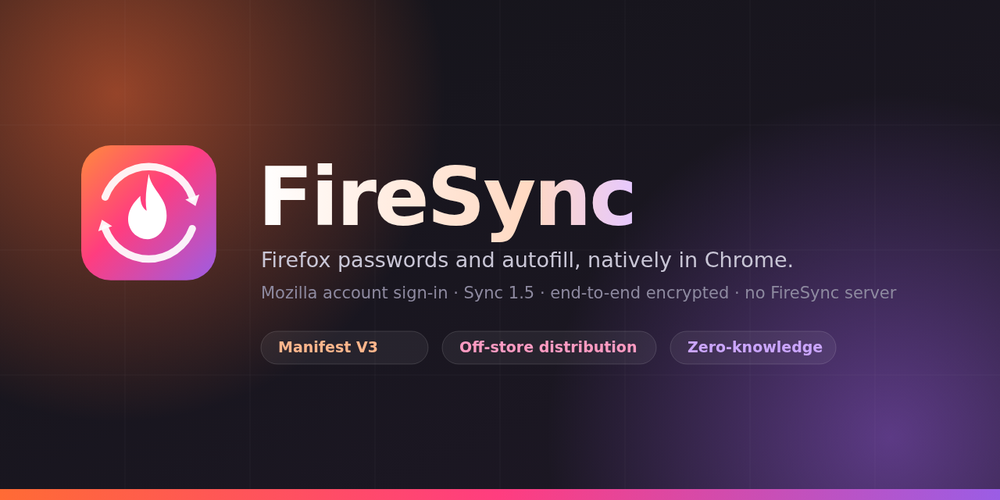

<p align="center">
  
</p>

<h1 align="center">FireSync</h1>

<p align="center">
  <strong>Sign in to your Mozilla account and use your Firefox passwords, addresses and
  per-site preferences in Chrome or Chromium.</strong><br>
  Manifest V3 · end-to-end encrypted with your own Sync key · no FireSync server, ever.
</p>

<p align="center">
  <a href="#status"></a>
  <a href="docs/TESTING.md"></a>
  <a href="LICENSE"></a>
</p>

---

## What this is

Firefox Sync is an open, documented, end-to-end encrypted protocol. FireSync speaks it
directly from a Chromium extension, so the logins you save in Firefox appear in Chrome and
the logins you save in Chrome appear back in Firefox — with no bridge service, no export
file, and no third party holding your vault.

- **Mozilla account sign-in**, including TOTP, emailed confirmation codes, and Mozilla's
  new-device sign-in unblock flow.
- **Two-way sync** of the `passwords` and `addresses` collections over Sync 1.5, with
  batched uploads, `X-If-Unmodified-Since` preconditions, and last-writer-wins conflict
  resolution keyed on `timePasswordChanged` — the same rule Firefox itself uses.
- **Autofill, save prompts and per-site preferences**, drawn by FireSync itself because
  Chrome does not let extensions reuse its native ones (see [why](#the-two-hard-limits)).
- **A local vault encrypted at rest** with a passphrase that never leaves the device, and
  auto-locking that actually clears the key from memory.
- **An optional local bridge** that imports your Firefox logins straight off disk — no
  Mozilla account, no network — plus OS-keychain storage for the vault key.
- **Off-store distribution**: a signed CRX, a self-hosted update manifest, and ready-made
  policy files for Linux, Windows and macOS.

## The two hard limits

Two things about this problem are not negotiable, and knowing them up front will save you
an afternoon:

**1. You cannot inject into Chrome's own password UI.** `chrome.passwordsPrivate` and
`chrome.autofillPrivate` are restricted to component extensions shipped inside the
browser. There is no supported way to add an entry to Chrome's save-password bubble or its
autofill dropdown. FireSync therefore draws its own — an in-field button, a credential
list, and a save/update bar — exactly as Bitwarden and 1Password do. To avoid two prompts
appearing at once, FireSync's policy files also turn Chrome's built-in manager off.

**2. Stock, unmanaged Google Chrome cannot install a self-hosted extension.** Chrome
requires a Web Store-issued *publisher proof* inside the CRX and rejects anything else with
`CRX_REQUIRED_PROOF_MISSING`; `--load-extension` was removed from branded builds in 137. The
only exemptions are enterprise policy on a **managed** browser and developer mode.
**Chromium and its derivatives are the primary target** — they enforce none of this, and
load unpacked builds, CRX drops, `--load-extension` and policy alike. Chrome remains a
supported option under those conditions. Full matrix in
[docs/DISTRIBUTION.md](docs/DISTRIBUTION.md).

## Quick start

```bash
git clone <this repo> firesync && cd firesync
npm install
npm run assets      # rasterise the icons with headless Chrome
npm run build       # bundle into dist/
npm test            # 328 unit + integration tests, no network needed
```

Then load it — **Chromium (or Brave, Vivaldi, ungoogled-chromium) is the smoothest path**:

1. Open `chrome://extensions`, turn on **Developer mode**, choose **Load unpacked**, and
   select the `dist/` directory. On Chromium you can also just drop the CRX onto that page;
   on stock Chrome you cannot — see [the matrix](docs/DISTRIBUTION.md#the-matrix).
2. FireSync opens its setup page. Choose a passphrase for the local vault, then connect
   your Mozilla account.
3. Turn off Chrome's own password manager at `chrome://settings/autofill` so the two do not
   both offer to save.

To produce a signed, self-hosted build instead:

```bash
npm run release     # typecheck + test + build + sign
# → build/firesync-0.1.0.crx, build/update.xml, build/extension-id.txt
```

Optionally install the local bridge, which adds Firefox profile import and OS-keychain
storage for the vault key:

```bash
cd bridge && ./install.sh <extension-id>   # id from chrome://extensions
```

## How it fits together

```
 Chrome page                    FireSync                        Mozilla
┌───────────────┐   overlay   ┌──────────────────┐   HTTPS   ┌────────────────────┐
│ login form    │◀───────────▶│ content script   │           │ accounts.firefox   │
│ (hostile JS)  │             │ detector/filler  │           │ .com   (sign-in)   │
└───────────────┘             └────────▲─────────┘           └─────────┬──────────┘
                                       │ messages                      │ OAuth
                              ┌────────┴─────────┐            ┌────────▼──────────┐
                              │ service worker   │───────────▶│ token.services    │
                              │ vault · sync15   │            │ .mozilla.com      │
                              │ fxa   · prefs    │            └────────┬──────────┘
                              └────────┬─────────┘                     │ Hawk
                        chrome.storage │                      ┌────────▼──────────┐
                        local(sealed)  │                      │ Sync 1.5 storage  │
                        session(keys)  ▼                      │ (AES-CBC + HMAC)  │
                                                              └───────────────────┘
```

Long version, with the exact protocol steps: [docs/ARCHITECTURE.md](docs/ARCHITECTURE.md)
and [docs/PROTOCOL.md](docs/PROTOCOL.md).

## Documentation

| Document | What is in it |
|---|---|
| [ARCHITECTURE.md](docs/ARCHITECTURE.md) | Layer-by-layer design, module map, data flow, service-worker lifecycle |
| [PROTOCOL.md](docs/PROTOCOL.md) | Every FxA and Sync 1.5 request, key derivation, record formats, the OAuth client-id problem |
| [SECURITY.md](docs/SECURITY.md) | Threat model, key hierarchy, what is stored where, known weaknesses |
| [AUTOFILL.md](docs/AUTOFILL.md) | Field detection heuristics, overlay design, capture and save flow |
| [BRIDGE.md](docs/BRIDGE.md) | The optional native host: local Firefox import, keychain, loopback OAuth |
| [DISTRIBUTION.md](docs/DISTRIBUTION.md) | Off-store install per platform, signing, auto-update, policy files |
| [DEVELOPMENT.md](docs/DEVELOPMENT.md) | Build, debug, add an engine, project conventions |
| [TESTING.md](docs/TESTING.md) | Test strategy, the fake Sync server, what is deliberately untested |
| [ROADMAP.md](docs/ROADMAP.md) | What is done, what is next, what is deliberately out of scope |
| [FAQ.md](docs/FAQ.md) | Short answers to the questions this design invites |

## Status

Alpha. The protocol layers are complete and covered end to end against an in-memory Sync
server; they have not been exercised against a large real account. Before you point this at
an account you care about, read [docs/TESTING.md](docs/TESTING.md#before-you-trust-it) — it
tells you how to test safely with a throwaway Mozilla account.

Known gaps, stated plainly:

- **Credit cards are read-only and off by default.** Firefox also protects card numbers
  with an OS keystore, and the payload schema has changed more than once. FireSync will
  never write to that collection until a real account has been observed round-tripping.
- **The OAuth client id is borrowed.** Mozilla has no self-serve registration for
  third-party Sync clients, so FireSync reuses a public Mozilla client id the way every
  other third-party client does. It works; it is unsanctioned; it is configuration rather
  than a constant so it can be changed. The [local bridge](docs/BRIDGE.md) exists partly as
  insurance: importing from a Firefox profile on disk depends on none of this. See
  [docs/PROTOCOL.md](docs/PROTOCOL.md#oauth-client-identity).
- **Bookmarks, history, tabs and forms are not synced.** Chrome has no comparable surface
  for most of them and the ones it does have are better served by other tools.

## Licence and affiliation

MIT. FireSync is an independent, unofficial project and is not affiliated with, endorsed
by, or sponsored by Mozilla or Google. "Mozilla", "Firefox", "Chrome" and "Chromium" are
trademarks of their respective owners, used here only to describe interoperability.
